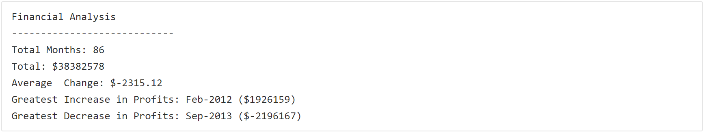
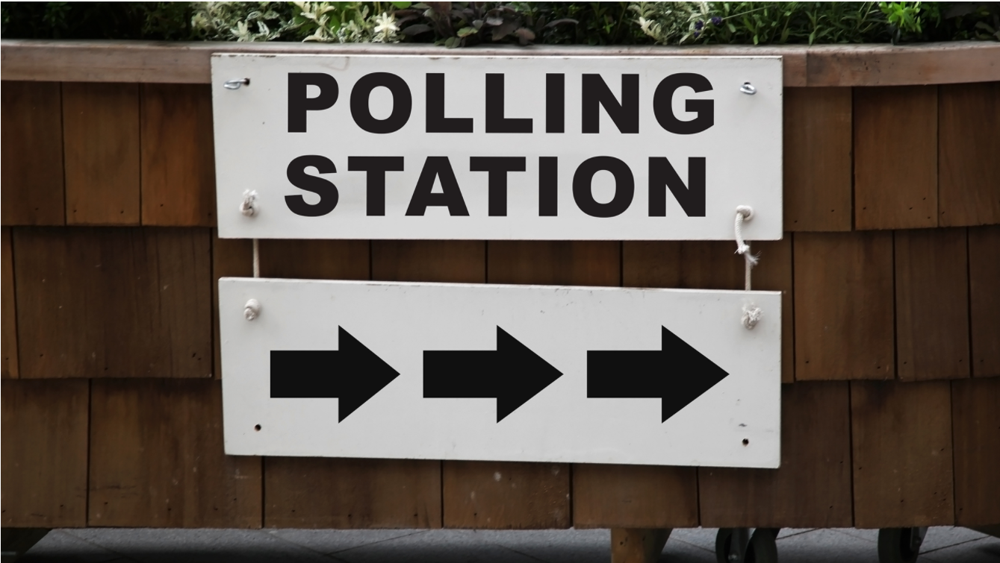
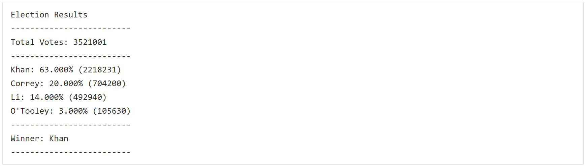

## python-challenge

# Python Homework Challenge - Py Me Up, Charlie
---------------------------------------------------------------------------------------------------------------------------------------------------------------------------------
# Background
A new repository for this project called python-challenge was created and was cloned to my computer.
Inside my local git repository, two directories were created: "PyBank" and "PyPoll". 
Inside PyBankd and PyPoll, two additional folders were created: "Resources" and "analysis".
The "Resources" folder contains the CSV files that was used and the main scripts "main.py" to run the analysis.
The "analysis" folder contains the text file with the results from the analysis. 

# Files:

**PyBank:**

* "PyBank/Resources/main.py"

* "PyBank/Resources/budget_data"

* "PyBank/analysis/PyBank_Results.txt"

**PyPoll:**

* "PyPoll/Resources/main.py"
* "PyPoll/Resources/election_data"
* "PyPoll/analysis/PyPoll_Results.txt"

# PyBank 

In this challenge, a Python script "PyBank/Resources/main.py" was created for analyzing the financial records of a company. A set of financial data called budget_data.csv was used.

In addition to the main.py final script, a "PyBank/analysis/PyBank_Results.txt" was exported with the results.

 

**The PayBank main.py script calculates the following:**

  * The total number of months included in the dataset

  * The net total amount of "Profit/Losses" over the entire period

  * The average of the changes in "Profit/Losses" over the entire period

  * The greatest increase in profits (date and amount) over the entire period

  * The greatest decrease in losses (date and amount) over the entire period
 
 **The PyBank analysis results are as follows:**
 

  
# PyPoll 

In this second challenge, a Python script "PyPoll/Resources/main.py" was created to help a small, rural town modernize its vote process. 

A set of poll data called election_data.csv was used.

In addition to the main.py final script, a "PyPoll/analysis/PyPoll_Results.txt" was exported with the results.

**The PayPoll main.py script calculates the following:**

  * The total number of votes cast

  * A complete list of candidates who received votes

  * The percentage of votes each candidate won

  * The total number of votes each candidate won

  * The winner of the election based on popular vote.
 
 **The PyPoll analysis results are as follows:**
  

